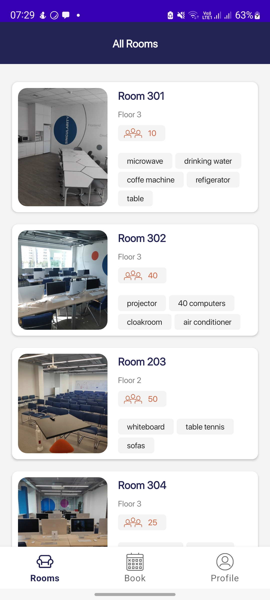
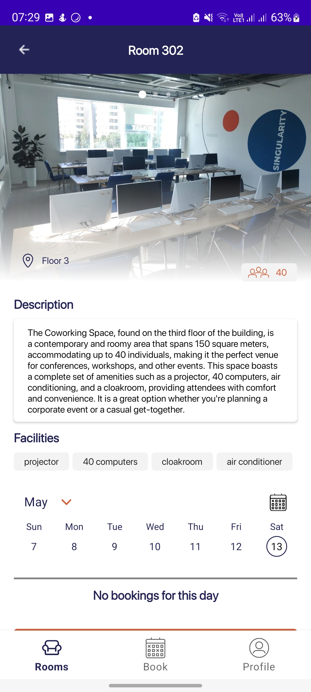
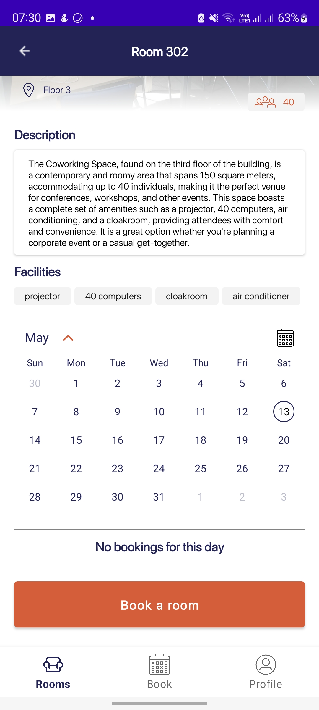
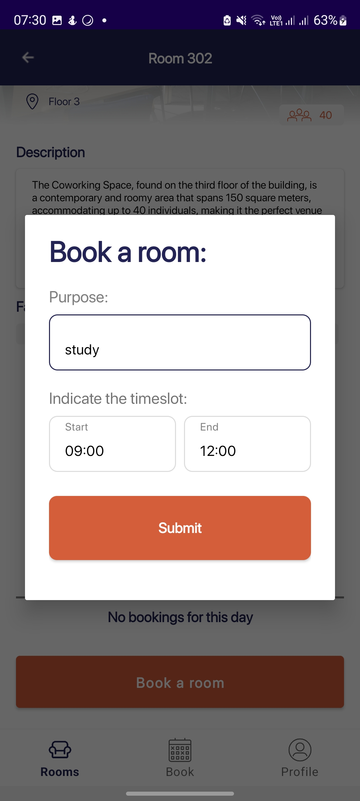
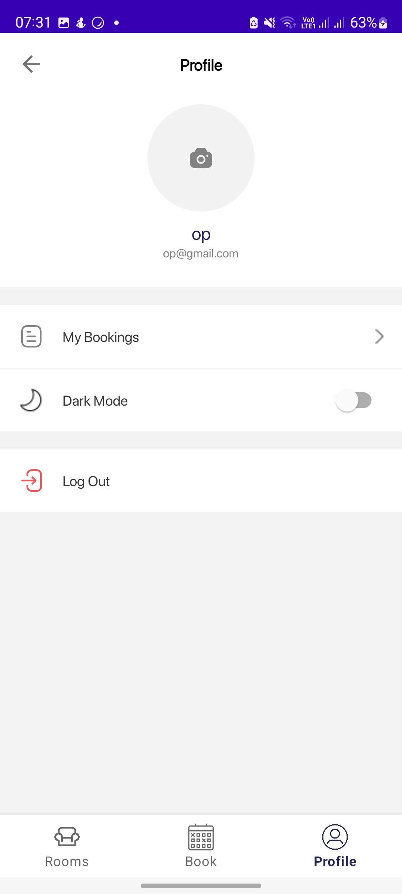
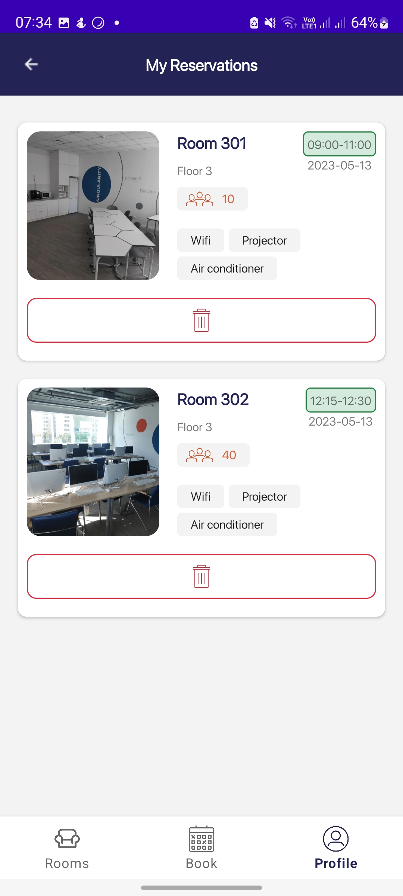

# Room-Booking-App
An intuitive Android app that simplifies the process of booking rooms, offering a seamless experience for finding, selecting, and reserving accommodations with ease.

## Demo
https://github.com/ulpanb123/Room-Booking-App/assets/73545133/81d4e073-6eb5-4b1e-9285-0ee2f2b8ae99

## Features
- Monitor the room availability
- Room booking

## Stack

**Language:** Kotlin

**Framework:** Native Android UI

**Architecture:** MVVM

## Libraries
- [Koin](https://insert-koin.io/docs/quickstart/android/) for DI
- [Android Jetpack Libraries](https://developer.android.com/jetpack?gclid=CjwKCAjwx_eiBhBGEiwA15gLN0cVADSEUwCDdIZN6Myte_XPK9VShZsVwNrX-uBQuP4uLqqHe0_3FRoCmVUQAvD_BwE&gclsrc=aw.ds)
- [Material Design](https://m2.material.io/develop/android)

## Screenshots
List of Rooms | Room details | Choose a date of booking
--- | --- | --- 
 |  |  

Booking Dialog | Profile page | User's bookings
--- | --- | --- 
 |  |  

